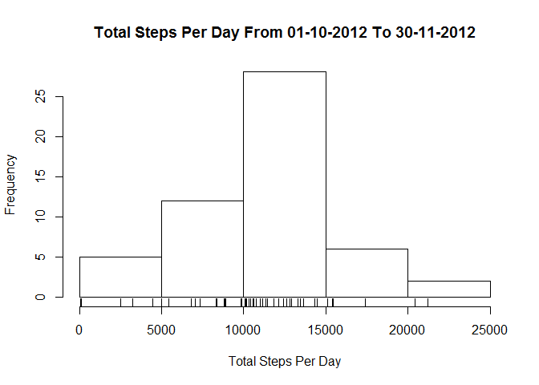
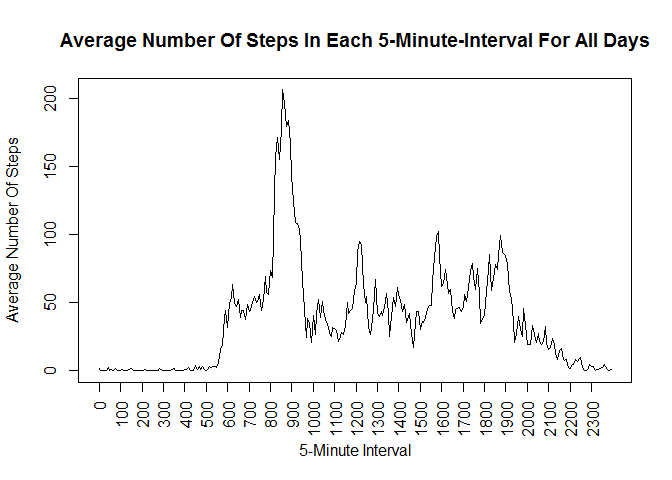
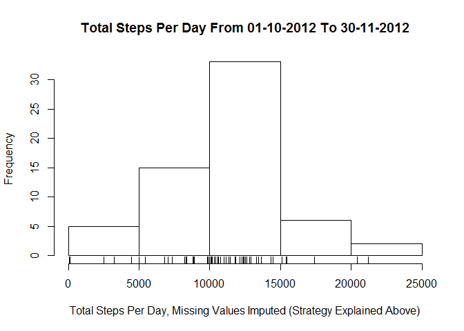
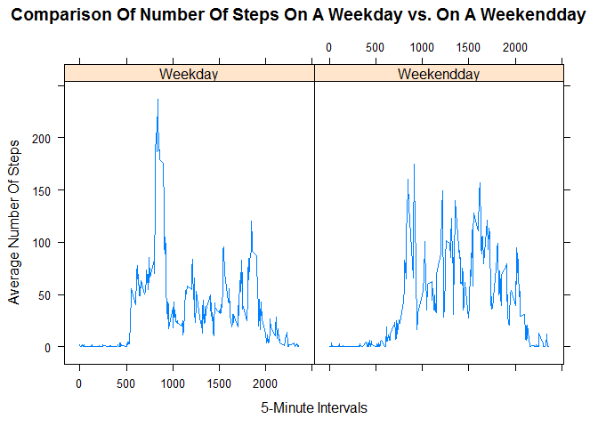

# Reproducible Research: Peer Assessment 1


<BR>

## Loading and preprocessing the data

*Loading and preprocessing the data*

*Show any code that is needed to*

*1.Load the data (i.e. read.csv())*

*2.Process/transform the data (if necessary) into a format suitable for your analysis*

<BR>

#### - - Libraries - -


```r
library(dplyr)
library(lattice)
```

<BR>

#### - - Loading - -


```r
if(!file.exists("./data")){dir.create("./data")}
fileUrl = "https://d396qusza40orc.cloudfront.net/repdata%2Fdata%2Factivity.zip"
download.file(fileUrl,
                destfile="./data/repdata_data_activity.zip")
RDA <- read.csv(unz("./data/repdata_data_activity.zip", "activity.csv"), 
                header=TRUE, stringsAsFactors=FALSE, dec=".")
unlink("./data/repdata_data_activity.zip")
```

<BR>

#### - - Processing - -


```r
RDA$date <- as.Date(RDA$date)              # convert character-date to date-date
```

<BR>

## What is mean total number of steps taken per day?

*For this part of the assignment, you can ignore the missing values in the dataset.*

*1.Calculate the total number of steps taken per day*

*2.If you do not understand the difference between a histogram and a barplot, research the difference between them. Make a histogram of the total number of steps taken each day*

*3.Calculate and report the mean and median of the total number of steps taken per day*

<BR>

#### - - Number of steps per day - -


```r
RDA_per_day <- RDA %>%                              # sum the steps for each day
        group_by(date) %>%
                summarise_each(funs(sum), steps)
```

<BR>

#### - - Histogram of daily steps - -


```r
hist(RDA_per_day$steps, 
        xlab="Total Steps Per Day", 
        main="Total Steps Per Day From 01-10-2012 To 30-11-2012")
rug(RDA_per_day$steps)
```

<!-- -->

<BR>

#### - - Mean and median of number of daily steps - -


```r
summary_RDA_per_day <- summary(RDA_per_day$steps) 
median_RDA_per_day  <- format(summary_RDA_per_day["Median"], digits="2")
mean_RDA_per_day    <- format(summary_RDA_per_day["Mean"], digits="2")
```

The median number of steps per day is 10760.  

The mean number of steps per day is 10770.

<BR>

## What is the average daily activity pattern?

*1.Make a time series plot (i.e. type = "l") of the 5-minute interval (x-axis) and the average number of steps taken, averaged across all days (y-axis)*

*2.Which 5-minute interval, on average across all the days in the dataset, contains the maximum number of steps?*

<BR>

#### - - Timeseries plot - - 


```r
RDA_per_interval <- tapply(RDA$steps, RDA$interval, mean, na.rm=TRUE) 
plot(RDA_per_interval, 
        type="l", 
        xlab="5-Minute Interval", 
        ylab="Average Number Of Steps", 
        main="Average Number Of Steps In Each 5-Minute-Interval For All Days", xaxt="n")
axis(1, at = seq(1, 288, by = 12), las=2, 
        labels=names(RDA_per_interval)[seq(1,288,by=12)])
```

<!-- -->

<BR>

#### - - Interval with highest average - - 


```r
interval_max <- names(which.max(RDA_per_interval))	
```

The interval with the highest average number of steps across all days is 835.


<BR>

## Imputing missing values

*Note that there are a number of days/intervals where there are missing values (coded as NA). The presence of missing days may introduce bias into some calculations or summaries of the data.*

*1.Calculate and report the total number of missing values in the dataset (i.e. the total number of rows with NAs)*

*2.Devise a strategy for filling in all of the missing values in the dataset. The strategy does not need to be sophisticated. For example, you could use the mean/median for that day, or the mean for that 5-minute interval, etc.*

*3.Create a new dataset that is equal to the original dataset but with the missing data filled in.*

*4.Make a histogram of the total number of steps taken each day and Calculate and report the mean and median total number of steps taken per day. Do these values differ from the estimates from the first part of the assignment? What is the impact of imputing missing data on the estimates of the total daily number of steps?*

<BR>

#### - - Number of NA - - 


```r
number_of_NA <- summary(RDA$steps)["NA's"]
```

The number of Missing Values in the steps data is 2304.

<BR>

#### - - Strategy for filling NA - -

The strategy for filling in the missing values is to look at the numbers that are available at similar weekdays
and intervals. Take the average of those numbers and impute it to the original NA.

<BR>

#### - - Create new dataset, with filled NA - -


```r
RDA$weekday <- as.factor(as.POSIXlt(RDA$date)$wday)   # add a factor for weekdays
                                                # number to avoid language issues
                                                # 0 = Sunday, 1 = Monday etc.
```


```r
RDA_NA <- subset(RDA, is.na(steps))                     # create subset of NA only

RDA_non_NA <- subset(RDA, !is.na(steps))                # create subset of non-NA
RDA_per_date_and_interval <-            # determine the weekday/interval averages
        RDA_non_NA %>%             
                group_by(weekday, interval) %>%                   
                        summarise_each(funs(mean), steps)        
RDA_impute <- merge(x=RDA_per_date_and_interval, 
        y=RDA_NA, by=c('interval', 'weekday'))          # join previous sets

RDA_impute$steps <- RDA_impute$steps.x                  # column with correct name
RDA_impute <- RDA_impute[c(6,5,1,2)]                    # select column for rbind

RDA_complete <- rbind(RDA_non_NA, RDA_impute)           # create improved dataset
```

<BR>

#### - - Histogram of steps per day with improved dataset - -


```r
RDA_per_day_c <- 
        RDA_complete %>%
                group_by(date) %>%
                        summarise_each(funs(sum), steps)
hist(RDA_per_day_c$steps, 
        xlab="Total Steps Per Day, Missing Values Imputed (Strategy Explained Above)", 
        main="Total Steps Per Day From 01-10-2012 To 30-11-2012")
rug(RDA_per_day_c$steps)
```

<!-- -->

<BR>

## Are there differences in activity patterns between weekdays and weekends?

*For this part the weekdays() function may be of some help here. Use the dataset with the filled-in missing values for this part.*

*1.Create a new factor variable in the dataset with two levels - "weekday" and "weekend" indicating whether a given date is a weekday or weekend day.*

*2.Make a panel plot containing a time series plot (i.e. type = "l") of the 5-minute interval (x-axis) and the average number of steps taken, averaged across all weekday days or weekend days (y-axis). See the README file in the GitHub repository to see an example of what this plot should look like using simulated data.*

<BR>

#### - - Create factor weekdays - -

This factor was created earlier in the script as I used weekdays for imputing NA.

<BR>

#### - - Create panel plot - - 


```r
RDA_complete$daytype <- ifelse(RDA_complete$weekday == 6 | RDA_complete$weekday == 0, 
        "Weekendday", 
        "Weekday")                                 # create a column for week(end)day

RDA_c_per_interval <- RDA_complete %>%               # average the steps for each day
        group_by(interval, daytype) %>%
                summarise_each(funs(mean), steps)

xyplot(steps ~ interval | daytype, 
        type="b", 
        data = RDA_c_per_interval, 
        layout = c(2, 1), 
        pch="",
        xlab = "5-Minute Intervals",
        ylab="Average Number Of Steps",
        main="Comparison Of Number Of Steps On A Weekday vs. On A Weekendday")
```

<!-- -->

